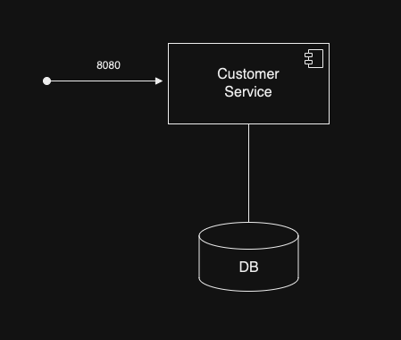
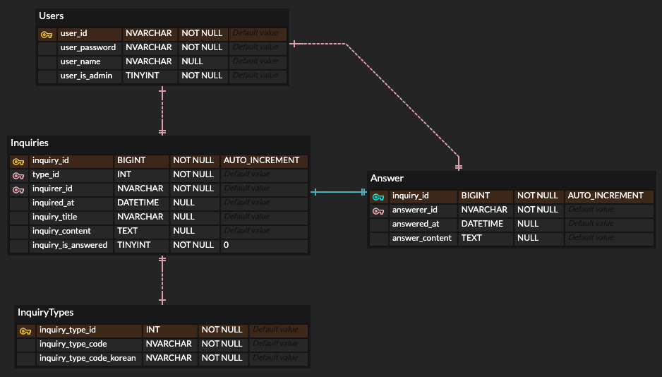

= 고객센터 구현 프로젝트

== 프로젝트 수행의 목적

* Sping Web MVC와 Spring Data JPA를 사용하여 간단한 웹 서비스를 구현해봄으로써, 
Spring Boot에서 편의성을 위해서 자동으로 수행하는 부분과 기존의 Spring Web MVC, Data JPA에서는 사용하지만 Boot에서는 사용되지 않는 어노테이션 및 설정들에 대하여 알아보고 
후에 Boot의 설정을 변경해야하는 경우에 사용해야하는 상황에 익숙해지고자 해당 프로젝트를 수행하게 되었습니다.

== 프로젝트 구조

* 기본적인 WAS서버와 DB서버의 연결로 구성되어있으며, WAS서버에서 사용자 인증과 문의를 처리하는 서비스 부분을 전부 담당합니다.

== DB 구조

* 사용자 : 해당 시스템을 사용하는 행위자 (고객센터 관리자, 문의자)
* 문의 : 고객 건의 등의 문의, 사용자가 작성할 수 있으며, 답변이 되어있는 상태인지 파악하는 속성도 추가적으로 포함되어 있습니다.
* 문의 종류 : 문의 종류에 대한 데이터의 소멸을 막기위해서 따로 정규화 해둔 테이블입니다. 
* 답변 : 고객의 문의사항에 관리자가 응답을 한 것으로 1개 문의에는 무조건 1개의 답변이 오는 것이 마땅하다고 판단됩니다.

== 보완해야 할 점

. Thymeleaf를 사용하여 화면을 구현하였으나, 화면의 중복되는 부분이 발생하게 되어 중복되는 화면을 삽입하는 등의 작업이 필요합니다.
. Spring Data JPA의 Pageable 인터페이스를 사용하여 Spring Data JPA가 제공하는 Pagination 구현하지 못하여 이를 구현하는 작업이 필요합니다.
. Entity와 @RequestBody가 붙은 객체를 가지고 값을 조작하였는데, DTO를 사용하여 데이터 통신의 안정성을 향상시킬 수 있었지만, 구현하지 못하여 추가적인 작업이 필요합니다.
. 구현하는데 성급하여, 테스트 코드를 작성하지 못하였는데 테스트 코드를 꼭 추가하여 발생할 에러에 대한 책임을 확실히 해야합니다.
. 현재 프로젝트의 구조가 1개의 서버에서 동일한 인증과 서비스 작업을 처리하고 있는데 이를 인증 서버와 서비스 서버로 분리하여 유지보수의 향상을 고려해야 합니다. 
